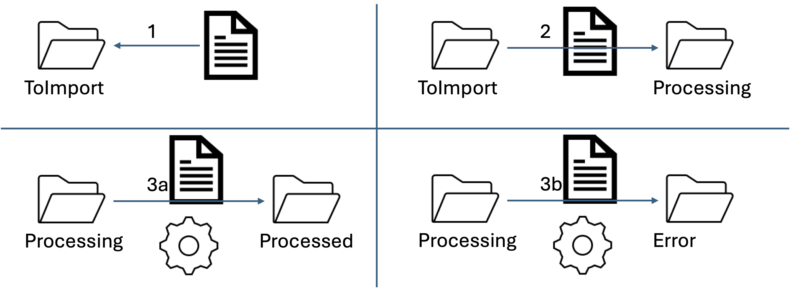

# Module 01 - Introduction

Dans cet exercice pratique, nous explorerons la manipulation de données provenant de fichiers plats à travers une application console .NET. Nous mettrons l'accent sur les opérations CRUD (Créer, Lire, Mettre à jour, Supprimer) sur une base de données SQL Server, en nous appuyant sur Entity Framework Core pour un accès et une gestion des données efficaces et abstraits. L'exercice couvrira la lecture de données depuis des fichiers CSV et JSON, illustrant la flexibilité dans le traitement de différentes sources de données. À travers ces tâches, nous appliquerons des concepts avancés de programmation et des bonnes pratiques de développement, notamment l'utilisation de modèles de conception tels que le Repository Pattern. Cet exercice est conçu pour renforcer vos compétences en intégration de données, développement .NET, gestion de bases de données, et programmation orientée objet.

## Préalable - Installation pour la base de données

Si SQL Server (Pas MySQL ni même Oracle SQL) n'est pas installé sur votre poste de travail, je vous conseille de l'installer à partir d'un conteneur docker.

Pour le lancer avec docker :

```bash
docker run --rm -d --name sqlserver -e "ACCEPT_EULA=Y" -e "MSSQL_SA_PASSWORD=Bonjour01.+" -e "MSSQL_PID=Developer" -p 1433:1433 -d mcr.microsoft.com/mssql/server:2022-latest
```

Si ce n'est pas fait, installez aussi SQL Server Management Studio (SSMS) : https://learn.microsoft.com/en-us/sql/ssms/download-sql-server-management-studio-ssms

Testez votre installation avec SSMS en vous connectant sur le serveur `.` avec l'authentification `SQL Server` et les identifiants `sa` et le mot de passe `Bonjour01.+`.

## Exercice 1 - Lecture des municipalités - CSV

À partir de la spécification donnée sur la page web contenant les données des municipalités vous allez extraire :

- Le code géographique
- Le nom de la municipalité
- L'adresse courriel
- L'adresse du site web
- La date des prochaines élections

Une fois ces données extraites, vous devez les insérer ou les mettre à jour dans une base de données Microsoft SQL Server.


Ce type de processus est généralement utilisé en entreprise pour des importations massives de données. Souvent un fichier est déposé dans un répertoire. À la détection d'un nouveau fichier dans ce répertoire, il est traité et ensuite archivé. Je vous ai mis un exemple de programme qui réaliser ces étapes avec un faux traitement qui attend ici 2 secondes pour le simuler dans le répertoire [FileSystemWatcher](FileSystemWatcher). En entreprise, on utilise généralement un outil d'infrastructure pour déclancher le traitement, comme un outil de gestion de traitements ou des outils d'intégration comme "Biztalk".



1. Un fichier à importer est déposé dans le répertoire `ToImport`
2. Le fichier est déplacé dans le répertoire `Processing`
3. a) Si pas d'erreur durant le traitement, le fichier est déplacé dans le répertoire `Processed`. b) En cas d'erreur le fichier est déplacé dans le répertoire `Error`

Ici, vous ne faites que le traitement mais vous pouvez implanter les autres étapes en exercice supplémentaire.

<details>
    <summary>Diagramme de classe global (Exemple)</summary>


</details>

### Étape 1 - Visualisation du fichier

- Téléchargez les données des municipalités à partir de [la page du MAMH du site des données libres du québec](https://www.donneesquebec.ca/recherche/fr/dataset/repertoire-des-municipalites-du-quebec/resource/19385b4e-5503-4330-9e59-f998f5918363)
- Ouvrez le document avec Visual Studio Code ou NotePad++ et essayez de comprendre la structure du fichier
- Ouvrez ce même fichier dans Excel, choisissez "Données" puis "Convertir". Arrangez-vous pour que le fichier s'affiche correctement

**N'enregistrez pas cette version du fichier, nous allons travailler sur la version originale**

### Étape 2 - Création d'un dépôt de type Entity Framework

---

Pour accéder à la base de données, utilisez Entity Framework Core. **Si vous ne connaissez pas cette bibliothèque, consultez l'article https://docs.microsoft.com/en-us/ef/core/ et familiarisez-vous avec l'approche Database-First.**

De manière simplifiée :

- Une propriété de type DbSet correspond à une table. Par convention, la table doit porter le même nom que la classe, et vice versa
- Le type paramétré du DbSet correspond à la structure de la table
- Par convention, la clé primaire est nommée d'après le nom de la classe suivi de `Id`. Par exemple, pour la table `Client`, on doit avoir une classe appelée `Client` et la clé primaire doit être stockée dans la propriété `ClientId`
- Chaque propriété de la classe correspond à un champ dans la table. Le type du champ détermine le type dans la base de données
- Il est possible de modifier le comportement par défaut en utilisant des attributs, mais il est conseillé de suivre la convention

Afin de respecter les bonnes pratiques vous devez implanter le patron `repository` que vous avez vu dans le [module 06 en POOII](https://github.com/PiFou86/420-W30-SF/blob/master/Module06_Formats_Echanges/Module06_Formats_Echanges_Exercices.md) dans le module sur les formats d'échanges de données.

Si c'est votre première utilisation d'entityFramework, il faut installer les outils. Pour cela, ouvrez une ligne de commande et tapez :

```powershell
dotnet tool install --global dotnet-ef
```

---

- Créez une solution Visual Studio du type "console" avec le cadriciel .Net 8.0. Le projet doit être nommé "DSED_M01_Fichiers_Texte"
- Ajoutez le projet "M01_Srv_Municipalite" de type "bibliothèque de classes". Ce projet va contenir le traitement de l'importation des données
- Ajoutez le projet "M01_Entite" de type "bibliothèque de classes". Ce projet va contenir la classe "Municipalite" qui contient les informations pertinentes sur les municipalitées.
- Ajoutez les interfaces "IDepotMunicipalites" et "IDepotImportationMunicipalites" :
  - IDepotMunicipalites :
    - ChercherMunicipaliteParCodeGeographique : int -> Municipalite (Renvoie la municipalité active ou non par son code géographique)
    - ListerMunicipalitesActives : () -> IEnumerable\<Municipalite> (Renvoie seulement les municipalités actives)
    - DesactiverMunicipalite : Municipalite -> ()
    - AjouterMunicipalite : Municipalite -> ()
    - MAJMunicipalite : Municipalite -> ()
  - IDepotImportationMunicipalite:
    - LireMunicipalite : () ->  IEnumerable\<Municipalite>
- Ajoutez le projet "M01_DAL_Municipalite_SQLServer" de type "bibliothèque de classes". Ce projet va implanter l'interface "IDepotMunicipalites" et avoir la classe "Municipalite" avec une propriété en plus nommée "Actif" de type booléen. Le booléen "Actif" permet simuler la suppression d'un enregistrement (suppression logique à la place de physique).
- Dans le projet "M01_DAL_Municipalite_SQLServer", installez les packages NuGet :
  - "Microsoft.EntityFrameworkCore.SqlServer" si vous décidez d'utiliser SqlServer
- Créez une classe de contexte qui peut se connecter à votre base de données (SQLServer)
  - Inspirez-vous de ce que vous avez fait en POO et en BD pour utiliser un fichier `appsettings.json`
- En utilisant SSMS, allez créer la base de données `municipalites`, créez la table `municipalites`ainsi que les colonnes correspontes à vos propriétés de votre DTO
- Validez que votre base de données à la bonne structure.

### Étape 3 - Lecture C# du fichier CSV

- Ajoutez le projet "M01_DAL_Import_Munic_CSV" de type "bibliothèque de classes"
- Ajoutez-y une classe qui implante l'interface "IDepotImportationMunicipalite"
- Codez la méthode "LireMunicipalite" - **Solution 1** :
  - Ouvrez le fichier en mode lecture
  - Lisez le fichier ligne par ligne (ReadLine)
  - Pour chacune des lignes, créez un objet de type "Municipalite" avec les bonnes valeurs. (Vous pouvez utiliser la méthode ["Split" de la classe "String"](https://docs.microsoft.com/en-us/dotnet/api/system.string.split?view=netcore-3.1))
- Codez la méthode "LireMunicipalite" - **Solution 2** :
  - Ouvrez le fichier en mode lecture
  - Utilisez la [bibliothèque CSV Helper](https://joshclose.github.io/CsvHelper/) (lire la documentation sur le site officiel)
  - Pour chacune des lignes, créez un objet de type "Municipalite" avec les bonnes valeurs.

### Étape 4 - Traitement du fichier

- À partir du projet "M01_Entite", ajoutez la classe "StatistiquesImportationDonnees" avec les propriétés suivantes :
  - NombreEnregistrementsAjoutes : int
  - NombreEnregistrementsModifies : int
  - NombreEnregistrementsDesactives : int
  - NombreEnregistrementsNonModifies : int
  - NombreMunicipalitesImportees : int
- Implantez la méthode "ToString" de cette dernière.
- À partir du projet "M01_Srv_Municipalite" :
  - Ajoutez la classe "TraitementImporterDonneesMunicipalite"
  - Créez un constructeur d'initialisation qui reçoit deux objets, un objet de type "IDepotImportationMunicipalite" et l'autre de type "IDepotMunicipalites".
  - Ajoutez la méthode "Executer" qui va réaliser la fusion des données ([Revoir exercice 2 du module 02 de POO](https://github.com/PiFou86/420-W30-SF/blob/master/Module02_TestsUnitaires/Module02_TestsUnitaires_Exercices.md)) : () -> StatistiquesImportationDonnees
    - Si la municipalité est manquante, l'ajouter
    - Si la municipalité est existante, la mettre à jour seulement si nécessaire (ex. si inactive, l'activer)
    - Si la municipalité n'existe pas dans le fichier à importer, la marquer inactive
    - Suivant le cas, incrémentez le compteur correspondant
    - À la fin du traitement, renvoie les statistiques

### Étape 5 - Programme principal

- Votre programme principal doit créer une instance de traitement. Pour cela, vous devez préalablement créer les instances des dépôts et les passer au constructeur d'initialisation.
- Le programme exécute ensuite le traitement et affiche les statistiques sur la sortie standard.

### Étape 6 - Tests unitaires

- Faîtes vos tests unitaires de la classe de traitement en utilisant les packages "XUnit" et "Moq".

## Exercice 2 - Lecture des municipalités - JSON (Optionnel)

- Refaites les étapes 1 (Affichage texte seulement sans Excel) et 3 de l'exercice 1 mais avec le format JSON disponible à l'adresse suivante : https://www.donneesquebec.ca/recherche/api/action/datastore_search?resource_id=19385b4e-5503-4330-9e59-f998f5918363&limit=3000. Pour désérialiser le fichier téléchargé, vous devez utiliser la méthode de la bibliothéque standard de .Net [Sytem.Text.Json.JsonSerializer.Deserialize](https://learn.microsoft.com/en-us/dotnet/api/system.text.json.jsonserializer.deserialize)
- Modifiez votre programme principal afin qu'il utilise maintenant le dépôt de type JSON pour faire vos exécutions.
