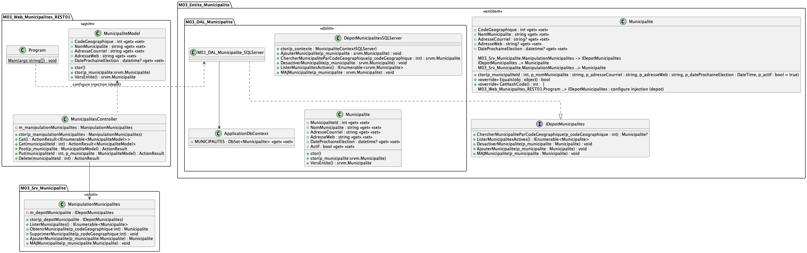

# Module 03 - REST 02

## Exercice 1 - Municipalités

L'objectif de l'exercice est de créer une API REST permettant de fournir les opérations CRUD aux entités de type Municipalités.

Voici un diagramme de classes qui peut vous inspirer :

### Exercice 1.1 - Création de l'API REST

- Partez de la solution présente à la racine de ce répertoire (DSED_Module03_QuickStartXYZ)
- Ajoutez le projet `M03_Web_Municipalites_REST01` de type "ASP.NET Core Web App (Model-View-Controller)" :
  - Choisissez le modèle général "ASP.NET Core Web App (Model-View-Controller)"
- Ajoutez les dépendances nécessaires pour que le projet puisse accéder à la base de données :
  - Ajoutez le package Nuget "Microsoft.EntityFrameworkCore.SqlServer"
  - Ajoutez les références vers le projet qui contient les entités et le projet qui contient la couche d'accès aux données SQL
  - Configurez le moteur d'injection de dépendances pour que le contexte de données soit injecté dans les contrôleurs
  - Ajoutez le fichier `appsettings.json` pour configurer la connexion à la base de données
  - Faites la même chose pour le dépôt de municipalités
- Ajoutez le support de Swagger en ajoutant le package Nuget "NSwag.AspNetCore" et en modifiant la classe "Program".
- Dans la couche service, ajoutez une classe de manipulation de municipalités :
  - Les municipalités sont définies comme dans les modules précédents
  - Le dépôt de municipalités est injecté dans le constructeur
  - Votre service doit permettre :
    - De lister les municipalités ou d'avoir l'information par rapport à un identifiant
    - De créer / modifier une municipalité
    - De supprimer une municipalité (suppression logique)
- Dans le projet Web, Ajoutez le contrôleur d'API "MunicipalitesController" :
  - Faites un clic droit sur le répertoire "Controller" de votre projet
  - Choisissez "Ajouter" puis "Contrôleur"
  - Choisissez "Contrôleur d'API avec actions de lecture/écriture" (Attention vous devez valider que c'est bien le contrôleur d'API et non le contrôleur MVC)
  - Appelez le contrôleur (la classe) "MunicipalitesController"
  - Ajustez chaque action pour qu'elles renvoient des "ActionResult" comme présenté dans la démonstration
  - Validez que vous renvoyez bien les codes HTTP appropriés et donnés dans la démonstration (Voir la démonstration présente dans la vidéo ou dans les répertoires de démonstration `DSED_Module03_Preparation_Cours_XYZ`)
- Testez votre API à travers les pages d'exploration d'API de Swagger

### Exercice 1.2 - Client console

- Créez une nouvelle solution à partir d'une nouvelle instance de Visual Studio (ie, votre solution précédente est toujours disponible)
- Créez le code C# client à partir de NSwag Studio
- Écrivez un programme qui :
  - Liste les municipalités et affiche leurs noms sur la console
  - Modifie le nom de la municipalité de Québec pour "Quebecq" ([retour aux sources de 1601](https://fr.wikipedia.org/wiki/Québec_(ville)#Toponymie))
***Avant de tester votre programme et de générer le code client, n'oubliez pas de valider que votre API est bien en cours d'exécution dans l'autre instance de Visual Studio***

## Exercice 2 - Ajout des élections (Optionnel)

Votre mission est d'ajouter le support des élections : une municipalité doit avoir la liste de ses élections :

- Vous devez donc garder l'information des élections :
  - un identifiant
  - un code géographique pour identifier la municipalité
  - une date d'élections

Pour réaliser l'ajout des élections :

- Ajoutez une table pour sauvegarder les élections (directement en SQL sans passer par les migrations d'entity framework : plus simple à réaliser)
- Ajoutez le support d'élections :
  - Modifiez votre "ApplicationDbContext" et les classes alentours pour ajouter la nouvelle table 
  - Ajouter le contrôleur d'API "ElectionsController". Il doit permettre les opérations de type CRUD sur les ressources de type "Election" à partir d'une municipalité (l'url doit inclure la municipalité)
  - Il doit y avoir un service spécifique aux municipalités et un pour les élections (ie deux classes dans le même projet)
  - La couche d'accès aux données utilise le même contexte applicatif
- Validez que le tout fonctionne avec Swagger UI.
