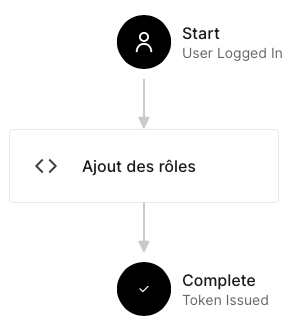

# Module 04 - Authentification

Objectifs :

- Observer le mécanisme d'authentification OpenID
- Mettre en place un contrôle de type clef API

<!-- ## Exercice 1 - Observation des mécanismes d'authentification dans une API ASP.Net MVC avec OpenID

### Exercice 1.1 - Mise en place de la solution

- Assurez-vous que [Firefox](https://www.mozilla.org) et [NodeJs](https://nodejs.org) sont installés sur votre poste de développement. Dans une console, entrez `node -v`
- Créez la solution Visual Studio "DSED_Module04_React" de type "ASP.NET Core avec React.js" et choisissez le framework ".NET 6.0" et le type d'authentification "Comptes d'utilisateurs individuels" (Si vous voulez créer le projet sans Visual Studio, créez-le en ligne de commande avec la commande ```dotnet new react --auth Individual --name "DSED_Module04_React"``` et faites ensuite un ```dotnet run``` pour lancer le programme)
- Compilez votre programme : la restauration des packages npm (node) va prendre un peu de temps. En attendant la fin, allez observer les attributs de la classe "WeatherForecastController"
- Une fois compilée, lancez l'exécution de votre projet principal.

### Exercice 1.2 - Création d'un premier compte -->

## Exercice 1 - Observation des mécanismes d'authentification dans une API ASP.Net MVC avec OpenID et le fournisseur Auth0

### Exercice 1.1 - Mise en place de l’authentification

- Téléchargez et ouvrez la solution Visual Studio "DSED_M04_Auth0Base" présente dans le répertoire de ce module
- Créez-vous un compte sur le site auth0.com
- Une fois le compte créé :
  - Authentifiez-vous
  - Créez une application en allant dans le tableau de bord dans le menu Applications > Applications et choisissez "+ Create Application"
  - Dans le champ "Name" entrez "DSED_M04_AuthoAuthentificationAutorisations", choisissez le type d’application "Regular Web Applications" et cliquez sur le bouton "Create"
- Votre application est maintenant créée dans Auth0, il va vous fournir des informations à renseigner dans le fichier appsettings.json de votre application ASP.Net. À partir du tableau de bord d’Auht0, allez dans l’onglet "Settings" de l’application que vous venez de créer.
  - Copiez l’information du champ "Domain" et insérez la dans le fichier de configuration de votre projet Visual Studio
  - Faites la même chose pour le champ "Client ID"
- Toujours à partir de la configuration de votre application, allez dans "Connections" et validez que tous les réseaux sociaux sont cochés afin de vous laisser plus de latitude sur les fournisseurs d’identité. Validez que "Username-Password-Authentication" est activé.
- À partir de votre projet "DSED_M04_Auth0Base", ouvrez le fichier "launchSettings.json" qui se trouve dans le répertoire "Properties". Repérez la section de profile qui se rapporte à votre projet Web "DSED_M04_Auth0Base" et cherchez la propriété "applicationUrl". Les valeurs présentes sont les URLs où est exposé votre site. Pour l’authentification, nous allons regarder l’URL en HTTPS ("https://localhost:7234") dans notre exercice.

Exemple :

```json
  "profiles": {
    "DSED_M04_Auth0Base": {
      "commandName": "Project",
      "dotnetRunMessages": true,
      "launchBrowser": true,
      "applicationUrl": "https://localhost:7234;http://localhost:5091",
      "environmentVariables": {
        "ASPNETCORE_ENVIRONMENT": "Development"
      }
    },
    "IIS Express": {
      "commandName": "IISExpress",
      "launchBrowser": true,
      "environmentVariables": {
        "ASPNETCORE_ENVIRONMENT": "Development"
      }
    }
```

- À partir du tableau de bord d’Auth0, rendez-vous dans la configuration de votre application et ajoutez "https://localhost:7234/callback" dans la liste des URLs de fonction de rappel (allowed callback URLs)
- Essayez de vous authentifier dans votre application, cela devrait fonctionner !
- Essayez de vous déconnecter. Vous devriez avoir une erreur. Analysez l’erreur et corrigez en suivant les indications. Réessayez pour valider que tout fonctionne correctement

### Exercice 1.2 - Observation des mécanismes d’authentification

- Passez votre navigateur en mode développement (Appuyez sur la touche F12 de votre clavier ou inspectez un élément). (Procédure testée avec Chrome et anciennement avec FireFox). Dans l’onglet "Réseau" ("Network") activez la conservation du journal ("Preserve log").
- Authentifiez vous et cherchez la requête de type "POST" sur "https://localhost:7234/callback". Dans "Charge utile" ("Payload"), cherchez le champ "id_token" puis copiez la valeur.
- Rendez-vous sur le site https://jwt.io/, collez la valeur et observez le contenu du jeton. Vous allez y voir trois parties : l’entête qui contient les informations sur le type de jeton, la charge utile qui contient les données et la signature électronique. Vous devriez aussi observer que ces trois parties sont en fait trois valeurs séparées par un point et encodées en base 64.
- Gardez les informations de l’entête et de la charge utile pour les comparer avec les informations que vous allez obtenir dans ce qui suit.

### Exercice 1.3 - Ajout de d'un rôle

- À partir du tableau de bord d’Auth0, allez dans l’onglet "User management/Roles" et créez un rôle "Administrateur"
- Une fois créée, cliquez sur dessus et ajoutez un utilisateur à ce rôle
- Allez maintenant dans la section "Actions/Triggers" et ouvrez le lien "post-login"
- Dans la partie de droite, et ajoutez une action à partir de rien "Build from scratch"
- Nommez votre action "Ajout des rôles" et laissez les options par défaut
- Dans le code, modifiez le code pour qu'il soit exactement comme suit :

```javascript
exports.onExecutePostLogin = async (event, api) => {
  const assignedRoles = (event.authorization || {}).roles;

  api.idToken.setCustomClaim('http://schemas.microsoft.com/ws/2008/06/identity/claims/role', assignedRoles);
};
```

- Déployez votre action en cliquant sur le bouton "Deploy" en haut à droite
- Cliquez sur "Back to triggers" et ajoutez votre action à la liste des actions à exécuter



- Cliquez sur "Apply"
- Déconnectez-vous de votre application et reconnectez-vous. Vous devriez voir un champ "http://schemas.microsoft.com/ws/2008/06/identity/claims/role" dans votre jeton. Ce champ contient les rôles de l’utilisateur. Vous devriez aussi voir apparaître une nouvelle page sur le site web "Coin des administrateurs" qui n’est accessible qu’aux utilisateurs ayant le rôle "Administrateur"

## Exercice 2 - Protégez votre API de municipalités

### Exercice 2.1 - Reproduire le mécanisme d'authentification par clef d'API

- Reprenez votre solution qui contient l'API de manipulation des municipalités
- Implantez le filtre qui valide la sécurité avec une clef API. Pour cela inspirez vous du cours.
- Ajoutez l'attribut que vous venez de créer à votre contrôleur "MunicipalitesController" 
- Validez que tout fonctionne avec "Postman"

### Exercice 2.2 - Améliorer la validation des clefs API en les stockant dans un dépôt de données

- Dans votre base de données, créez la table "ClefAPI" avec la clef primaire "ClefAPIId" de type Guid ou VARCHAR(140) si le type Guid n'existe pas
- De retour dans votre projet, créez la classe "ClefAPI" qui permet de stocker des clefs API de type "Guid"
- À partir de la classe "ApplicationDbContext", ajoutez la propriété table "ClefsAPIs" de type "DbSet\<ClefAPI>"
- Modifiez votre dépot afin de pouvoir valider l'existance d'une clef API dans la table éponyme clef API
- Modifiez le filtre d'authentification afin de valider la clef, non pas à partir de votre constante mais à partir du dépot. Inspirez-vous du code qui suit pour obtenir le dépôt
- Validez que le tout fonctionne

Si vous avez besoin d'un objet, comme un dépot, vous pouvez utiliser la méthode "GetService" de la propriété RequestServices du contexte http :

```csharp
using Microsoft.Extensions.DependencyInjection;
// ...

[AttributeUsage(AttributeTargets.Class | AttributeTargets.Method)]
public class ApiKeyAttribute : Attribute, IAsyncActionFilter {
  public async Task OnActionExecutionAsync(ActionExecutingContext p_context, ActionExecutionDelegate p_next) {
    IDepotXYZ appContext = p_context.HttpContext.RequestServices.GetService<IDepotXYZ>();

    // ...
  }
}
```
