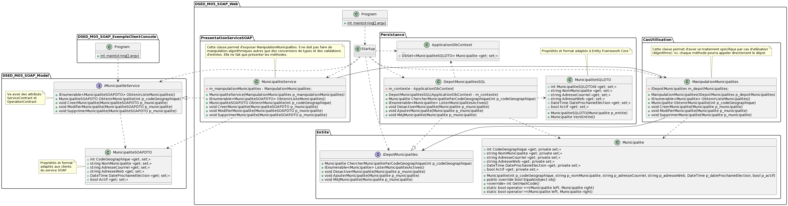

# Module 05 - SOAP

## Exercice 1 - Service de base

- Créez la solution Visual Studio "DSED_M05_Ex01" de type "Application web ASP.Net Core". Vous pouvez prendre le gabarit vide
- Ajoutez le projet "DSED_M05_Model" de type "Bibliothèque de classes"
- Créez le service "Operations" qui propose les opérations sur des "float" suivantes :
  - Addition
  - Soustraction
  - Multiplication
  - Division
  - Racine carré
- Faites un GET de l'adresse de votre service et observez le fichier WSDL généré
- Créez un client qui permet de tester votre service

## Exercice 2 - Municipalités

- Reprenez votre solution qui contient l'API de manipulation des municipalités
- Implantez un service qui correspond à toutes les méthodes du dépot
- Faites un GET de l'adresse de votre service et observez le fichier WSDL généré
- Créez un client qui permet de tester votre service

    
Diagramme de package global

    
Diagramme de classe global

