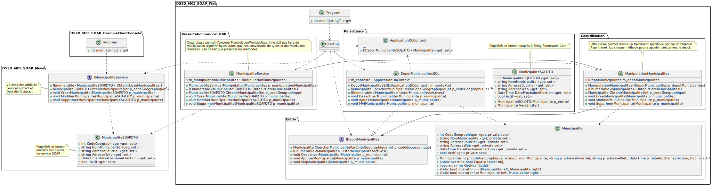

# Module 05 - SOAP

## Exercice 1 - Service de base

- Créez la solution Visual Studio "DSED_M05_Ex01" de type "Application web ASP.Net Core". Vous pouvez prendre le gabarit vide
- Ajoutez le projet "DSED_M05_Model" de type "Bibliothèque de classes"
- Créez le service "Operations" qui propose les opérations sur des "float" suivantes :
  - Addition
  - Soustraction
  - Multiplication
  - Division
  - Racine carré
- Faites un GET de l'adresse de votre service et observez le fichier WSDL généré
- Créez un client qui permet de tester votre service

## Exercice 2 - Municipalités

- Reprenez votre solution qui contient l'API de manipulation des municipalités
- Implantez un service qui correspond à toutes les méthodes du dépot
- Faites un GET de l'adresse de votre service et observez le fichier WSDL généré
- Créez un client qui permet de tester votre service. Attention, si vous allez chercher toutes les municipalités, vous allez avoir un problème de taille de messages. Afin de ne pas l'avoir, il faut modifier la propriété "MaxReceivedMessageSize" avec une valeur de 10Mo (1024 * 1024 * 10) de l'objet "BasicHttpBinding".

<details>
    <summary>Diagramme de package global</summary>


</details>

<details>
    <summary>Diagramme de classe global</summary>

Dans ce diagramme, les packages sont les projets, les sous-packages des dossiers.


</details>

<details>
    <summary>Comment obtenir un `ManipulationMunicipalite` dans le service SOAP ?</summary>
  
Lorsque vous travaillez avec un service SOAP dont le cycle de vie est configuré en mode `Singleton` (c'est-à-dire qu'il persiste pour la durée de vie de l'application), vous pouvez rencontrer certains défis en essayant d'utiliser des objets dont le cycle de vie est différent. Par exemple, `ManipulationMunicipalite` est déclaré avec un cycle de vie de type `Scoped` (limité à la durée de vie d'une requête), ce qui signifie qu'il ne peut pas être injecté directement dans un objet `IMunicipaliteService` de cycle de vie `Singleton`.

Pour résoudre ce problème, une approche consiste à utiliser le service d'injection de dépendances lui-même. Vous pouvez demander une référence à l'`IServiceProvider` en le passant comme paramètre au constructeur de votre `MunicipaliteService`. Ensuite, stockez cette référence dans une variable membre, par exemple `m_serviceProvider`.

Avec cette référence, vous pouvez créer une nouvelle portée de type `Scoped` en utilisant la méthode éponyme `CreateScope`. Cela vous permettra de demander des instances de `Scoped` depuis le service d'injection de dépendances.

Voici un exemple de code en C# illustrant cette approche :

```csharp
public MunicipaliteModel ObtenirMunicipalite(int p_codeGeographique)
{
    using (IServiceScope scope = m_serviceProvider.CreateScope())
    {
        ManipulationMunicipalites manipMunicipalites = scope.ServiceProvider.GetService<ManipulationMunicipalites>();
        // Ici, vous pouvez utiliser manipMunicipalites selon vos besoins
        // ...
    }
}
```

Cette méthode garantit que vous respectez les cycles de vie de vos services tout en conservant la flexibilité nécessaire pour utiliser des services Scoped dans un contexte Singleton.

</details>
