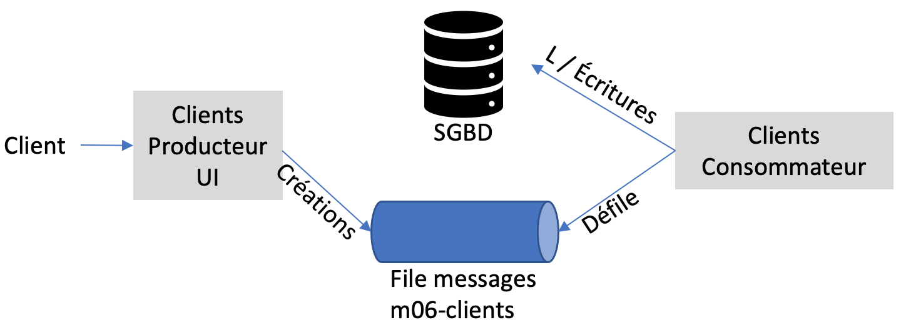
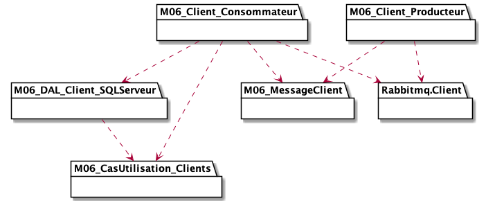
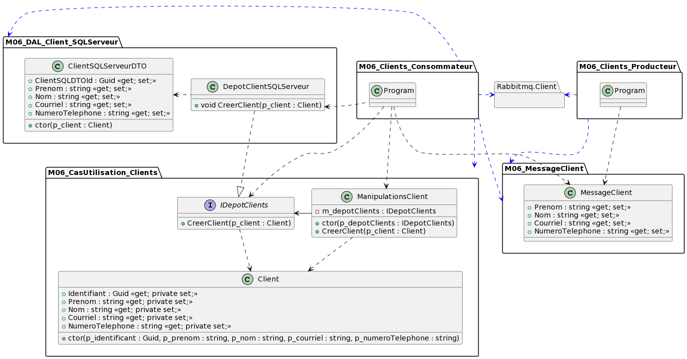
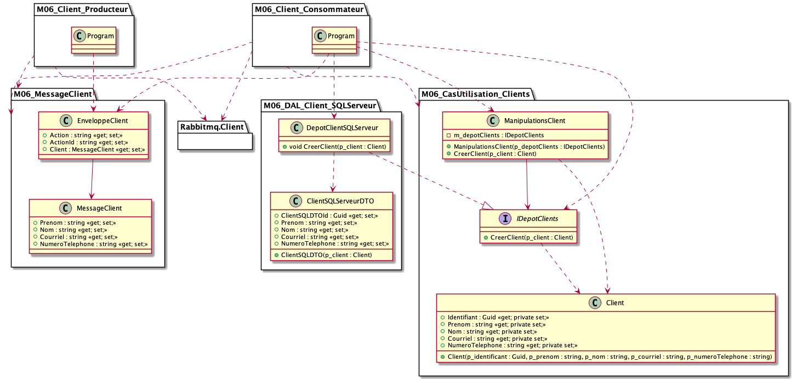
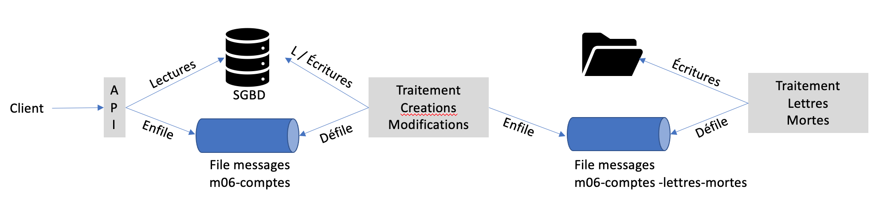

# Module 06 - File de messages

## Pré-requis

Nous allons utiliser une file de messages locale appelée RabbitMQ.

Pour l'installer :

- Ouvrez un interpréteur Powershell avec les privilèges administrateur
- Tapez la commande suivante :

```pwsh
choco install rabbitmq
```

- Acceptez d'exécuter tous les scripts
- Une fois installé, validez que le service est démarré et fonctionnel en tapant la commande suivante : ```rabbitmqctl.bat status```
- Si la commande ne fonctionne pas, ajoutez le répertoire "c:\program files\RabbitMQ server\rabbitmq_server-x-y-z\sbin" à votre variable d'environnement "PATH" en adaptant le chemin à votre installation

## Exercice 1 - Mes premiers messages

- Créez la solution "DSED_M06_ProdCons" avec deux projets de type "console"
  - Le premier produira des messages. Les messages sont lu sur la console (ReadLine) et envoyé sur la file "m06-mes-premiers-messages"
  - Le second programme doit écouter la file "m06-mes-premiers-messages" en continu et afficher les messages reçus sur la console

## Exercice 2 - Création de clients

Un client est défini par :

- Un identifiant de type Guid
- Un prénom, un nom
- Une adresse courriel
- Un numéro de téléphone

### Exercice 2.1 - Version simple

- Créez la solution "DSEC_M06_Clients" avec deux projets de type "console" :
  - "M06_Clients_Producteur_UI" : permet de saisir un client et de l'envoyer à la file de messages "m06-clients". Le client est envoyé sous forme de document JSON
  - "M06_Clients_Consommateur" : écoute la file "m06-clients" et enregistrer les clients dans une base de données
- Essayez le programme

<details>
  <summary>Indices</summary>



</details>

<details>
    <summary>Proposition solution - diagramme de packages</summary>



</details>

<details>
    <summary>Proposition solution - diagramme de classes</summary>



</details>

### Exercice 2.2 - Ajoutons une enveloppe

Plutôt que d'envoyer votre client directement, vous devez utiliser une enveloppe qui contient :

- Le type d'action, ici "create"
- Un identifiant d'action
- Le client

Modifiez le programme pour tenir compte de cette dernière contrainte.

<details>
    <summary>Proposition solution - diagramme de classes</summary>



</details>

## Exercice 3 - Gestion d'un compte bancaire

Un compte bancaire a numéro de compte, un type qui sera ici égal à "courant" et des transactions.

Une transaction est soit de type crédit, débit. Elle contient aussi une date et un montant.

Vous devez proposer une API REST qui permet de consulter, créer, modifier un compte. La suppression est interdite. Les données doivent être persistées dans une base de données.

Vous devez aussi proposer une API REST qui permet de consulter, créer une transaction. La modification et la suppression est interdite.

Les API précédentes ne doivent pas appliquer les créations et modifications en synchrone, vous devez les envoyer dans la file de messages "m06-comptes".

En effet, les deux API ont deux types d'actions :

- Consultation qui va être comme vous avez fait jusqu'à maintenant. Donc ici, les deux contrôleurs vont consulter directement le dépot de données.
- Création / modification qui va être en asynchrone et donc passer par une file de messages. Les deux contrôleurs vont envoyer les créations / modifications dans la file de messages. L'API est donc productrice seulement ici.

Le programme console "TraitementCreationsModifications" doit lire les messages de la file "m06-comptes" et essayer de les exécuter. Il va se comporter comme un consommateur. Si les messages causes des erreurs, envoyez les messages dans la file "m06-comptes-lettres-mortes". Il va donc aussi agir comme producteur.

Le programme console "TraitementLettresMortes" doit lire les messages de la file "m06-comptes-lettres-mortes" et créer un fichier par message. Chaque fichier doit être enregistré dans le répertoire "TransactionsEnErreurs" avec un nom unique. Le nom doit être constitué de l'année, du mois, du jour, de l'heure, des minutes, des secondes, d'un guid et de l'extension ".json".

<details>
  <summary>Indices</summary>

| Programme       | Entité       |   Action   |   Dépot de données |
|-----------------|--------------|------------|--------------------|
| API             | Compte       | GET        | Base de données    |
| API             | Compte       | GET(id)    | Base de données    |
| API             | Compte       | POST       | File de messages   |
| API             | Compte       | PUT(id)    | File de messages   |
| API             | Compte       | DELETE     | 403                |
| API             | Transaction  | GET        | Base de données    |
| API             | Transaction  | GET(id)    | Base de données    |
| API             | Transaction  | POST       | File de messages   |
| API             | Transaction  | PUT(id)    | 403                |
| API             | Transaction  | DELETE     | 403                |



</details>

Vous trouverez ci-après une très belle démonstration des programmes demandés proposée par Raoul Hunter-Villeneuve (Session hiver 2020). Il y montre les trois programmes en parallèle avec une interface texte très évoluée. Il a configuré son programme pour avoir une probabilité de 20% d'erreurs. Merci à lui !

[](https://www.youtube.com/watch?v=Z7ohFgi-ukA)
