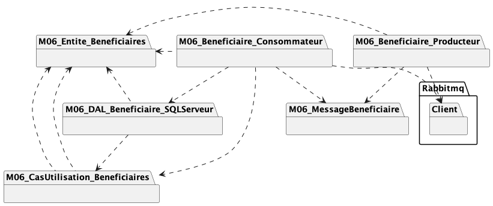

# Module 06 - File de messages

## Pré-requis

Nous allons utiliser une file de messages locale appelée RabbitMQ. Vous pouvez soit l'installer localement sur votre environnement ou réinvestir les connaissances du cours ISS et utilise un conteneur.

### Installation avec docker

Il faut que docker fonctionne sur votre environnement de travail.

Utilisez l'image présente sur [docker hub](https://hub.docker.com/_/rabbitmq).

À l'écriture de l'exercice on peut utiliser la commande suivante pour lancer la version 3 :

```bash
docker run --rm -d --name s4_DSED_rabbitmq -p 8080:15672 -p 5672:5672 rabbitmq:3-management
```

Ce conteneur contient aussi la partie gestion graphique des ressources RabbitMQ. Pour y accéder, allez sur ```http://localhost:8080/```. Nom d'utilisateur ```guest``` et mot de passe ```guest```.

### Installation locale

Pour l'installer sur votre VM ou machine locale :

- Ouvrez un interpréteur Powershell avec les privilèges administrateur
- Tapez la commande suivante :

```pwsh
choco install rabbitmq
```

- Acceptez d'exécuter tous les scripts
- Une fois installé, validez que le service est démarré et fonctionnel en tapant la commande suivante : ```rabbitmqctl.bat status```
- Si la commande ne fonctionne pas, ajoutez le répertoire "C:\Program Files\RabbitMQ server\rabbitmq_server-x.y.z\sbin" à votre variable d'environnement "PATH" en adaptant le chemin à votre installation

<details>
  <summary>Problème durant l'installation ou l'exécution</summary>

Vous trouverez [ici](https://stackoverflow.com/questions/16001047/rabbitmq-fails-to-start) des indices sur la façon de résoudre vos problèmes (Merci à Jonathan Blouin pour le partage !).
  
En substance (extrait d'une des réponses) :

- Set Environment variable-
  - RABBITMQ_BASE C:\RabbitMQ Server
  - ERLANG_HOME C:\Program Files\erl-10.7
- Config MQ Server
  - stop RabbitMq : rabbitmq-service.bat stop
  - Enable management : rabbitmq-plugins.bat enable rabbitmq_management
  - Reinstall server : rabbitmq-service.bat install
  - Start Server : rabbitmq-service.bat start
  - Start App : rabbitmqctl.bat start_app  
</details>

## Exercice 1 - Mes premiers messages

- Créez la solution "DSED_M06_ProdCons" avec deux projets de type "console"
  - Le premier produira des messages. Les messages sont lu sur la console (ReadLine) et envoyé sur la file "m06-mes-premiers-messages"
  - Le second programme doit écouter la file "m06-mes-premiers-messages" en continu et afficher les messages reçus sur la console

## Exercice 2 - Création de bénéficiaires

Un bénéficiaire est défini par :

- Un identifiant de type Guid
- Un prénom, un nom
- Une adresse courriel
- Un numéro de téléphone

### Exercice 2.1 - Version simple

- Créez la solution "DSED_M06_Beneficiaires" avec deux projets de type "console" :
  - "M06_Beneficiaires_Producteur_UI" : permet de saisir un bénéficiaire et de l'envoyer à la file de messages "m06-beneficiaires". Le bénéficiaire est envoyé sous forme de document JSON
  - "M06_Beneficiaires_Consommateur" : écoute la file "m06-beneficiaires" et enregistrer les bénéficiaires dans une base de données
- Essayez le programme

<details>
  <summary>Indices</summary>


</details>

<details>
    <summary>Proposition solution - diagramme de packages</summary>



</details>

<details>
    <summary>Proposition solution - diagramme de classes</summary>


</details>

### Exercice 2.2 - Ajoutons une enveloppe

Plutôt que d'envoyer votre bénéficiaire directement, vous devez utiliser une enveloppe qui contient :

- Un identifiant unique de message (Ex. Guid)
- Le type d'entité sur laquelle on agit, ici "beneficiaire"
- Le type d'action, ici "create"
- Le bénéficiaire

Modifiez le programme pour tenir compte de cette dernière contrainte.

<details>
    <summary>Proposition solution - diagramme de classes</summary>


</details>

## Exercice 3 - Gestion d'un compte bancaire

Un compte bancaire a numéro de compte, un type qui sera ici égal à "courant" et des transactions.

Une transaction est soit de type crédit, débit. Elle contient aussi une date et un montant.

Vous devez proposer une API REST qui permet de consulter, créer, modifier un compte et qui permet de consulter, créer une transaction. La suppression des comptes est interdite. La modification et la suppression de transactions sont interdites. Les données doivent être persistées dans une base de données.

L'API précédente ne doit pas appliquer les créations et modifications en mode synchrone, vous devez les envoyer dans la file de messages "m06-comptes".

En effet, l'API a deux types d'actions :

- Consultation qui va être comme vous avez fait jusqu'à maintenant. Donc ici, les deux contrôleurs vont consulter directement le dépot de données.
- Création / modification qui va être en asynchrone et donc passer par une file de messages. Les deux contrôleurs vont envoyer les créations / modifications dans la file de messages. L'API est donc productrice seulement ici.

Le programme console "TraitementCreationsModifications" doit lire les messages de la file "m06-comptes" et essayer de les exécuter. Il va se comporter comme un consommateur. Si les messages causes des erreurs, envoyez les messages dans la file "m06-comptes-lettres-mortes". Il va donc aussi agir comme producteur.

Le programme console "TraitementLettresMortes" doit lire les messages de la file "m06-comptes-lettres-mortes" et créer un fichier par message. Chaque fichier doit être enregistré dans le répertoire "TransactionsEnErreurs" avec un nom unique. Le nom doit être constitué de l'année, du mois, du jour, de l'heure, des minutes, des secondes, d'un guid et de l'extension ".bin".

<details>
  <summary>Indices</summary>

| Programme       | Entité       |   Action   |   Dépot de données | Exemple URI                                          |
|-----------------|--------------|------------|--------------------|------------------------------------------------------|
| API             | Compte       | GET        | Base de données    | ../comptes                                           |
| API             | Compte       | GET(id)    | Base de données    | ../comptes/{compteId}                                |
| API             | Compte       | POST       | File de messages   | ../comptes                                           |
| API             | Compte       | PUT(id)    | File de messages   | ../comptes/{compteId}                                |
| API             | Compte       | DELETE     | 403                | N/A                                                  |
| API             | Transaction  | GET        | Base de données    | ../comptes/{compteId}/transactions                   |
| API             | Transaction  | GET(id)    | Base de données    | ../comptes/{compteId}/transactions/{transactionId}   |
| API             | Transaction  | POST       | File de messages   | ../comptes/{compteId}/transactions                   |
| API             | Transaction  | PUT(id)    | 403                | N/A                                                  |
| API             | Transaction  | DELETE     | 403                | N/A                                                  |


Il est fortement recommandé de créer une enveloppe contenant :
  
- Une chaine de caractères représentant le type d'action
- Une chaine de caractères représentant l'entité modifiée
- Une propriété par entité (Compte et Transaction). Suivant l'entité visée, un des champs sera `null`. Cette astuce est là pour vous faire gagner du temps de développement. D'une certaine manière, elle brise l'OCP.
  
</details>

### Exercice 3 - Aller plus loin (optionnel)

Pour aller plus loin, voici deux pistes d'extension (qui se suivent) à l'exercice :

1. Remplacez les propriétés créées par entité par un champ unique appelé `Corps` qui représente les informations de l'entité à créer/modifier en version chaine de caractères. Ce champ va contenir la version sérialiser en JSON.
2. Ajoutez des signatures dans vos messages à la production et validez la au moment des traitements. Pour cela, séparez votre enveloppe en trois (3) parties :
  - Une entête qui contient le type d'entité, d'action et un identifiant d'action
  - Un corps de message
  - Une pied qui contient deux signatures électroniques : celle de l'entête et celle du corps de message

Exemple de document JSON :

```json
{
    "header": "{\"id\":\"0bd48cf3-d7c6-45f3-9f30-1054658c53d4\",\"entity\":\"transaction\",\"action\":\"create\",\"version\":\"v1\"}",
    "body": "{\"compteId\":\"b5e2037a-5824-42c9-8f4e-3e0012a49073\",\"type\":\"credit\",\"date\":\"2023-12-18T19:03:09.543Z\",\"montant\":42.42}",
    "signature": {
        "hashmethod": "SHA256",
        "bodysignature": "Vml2ZSBsZXMgY2hvY29sYXRpbmVzLCBhcnLqdGV6IGRlIGTpY29kZXIgbGVzIG1lc3NhZ2VzIQ==",
        "headersignature": "Vml2ZSBsZSBwYXlzIGJhc3F1ZSBsLi4uIGhldSAhIHZpdmUgbGUgcGF5cyBiYXNxdWUgISEh",
        "publickey": "Tm9uIG1haXMgY2Egc3VmZml0ICE="
    }
}
```

Références :
- Création de hash : https://learn.microsoft.com/en-us/dotnet/api/system.security.cryptography.hashalgorithm.computehash
- Aide pour crypter des messages : https://stackoverflow.com/questions/17128038/c-sharp-rsa-encryption-decryption-with-transmission

<details>
  <summary>Simon Quillaud de la session hiver 2023 vous propose une classe utilitaire pour réaliser la signature et la vérification de la signature</summary>
  
```csharp
public class ClesRSAPersonnelles
{
    private string _clePrivee;
    private string _clePublique;
    public string ClePublique { get { return this._clePublique; } }

    // Prends en paramètre les clés privées et publiques
    public ClesRSAPersonnelles(string p_clePriveeXml, string p_clePubliqueXml)
    {
        if (String.IsNullOrWhiteSpace(p_clePriveeXml))
        {
            throw new ArgumentNullException(nameof(p_clePriveeXml));
        }
        if (String.IsNullOrWhiteSpace(p_clePubliqueXml))
        {
            throw new ArgumentNullException(nameof(p_clePubliqueXml));
        }

        this._clePrivee = p_clePriveeXml;
        this._clePublique = p_clePubliqueXml;
    }

    // Crypte le message avec la clé publique du destinataire
    public string CrypterMessage(string p_message, string p_clePubliqueDestinataireXml)
    {
        if (String.IsNullOrWhiteSpace(p_clePubliqueDestinataireXml))
        {
            throw new ArgumentNullException(nameof(p_clePubliqueDestinataireXml));
        }

        if (String.IsNullOrWhiteSpace(p_message))
        {
            throw new ArgumentNullException(nameof(p_message));
        }

        string retour;

        using (RSACryptoServiceProvider rsa = new RSACryptoServiceProvider())
        {
            rsa.FromXmlString(this.p_clePubliqueDestinataireXml);

            byte[] message = Encoding.UTF8.GetBytes(p_message);
            byte[] messageCrypte = rsa.Encrypt(message, true);
            retour = Convert.ToBase64String(messageCrypte);
        }

        return retour;
    }

    // Décrypte le message avec la clé privée (donc du destinataire qui est l'objet courant)
    // Le message est en base64
    public string DecrypterMessage(string p_message)
    {
        string retour;

        using (RSACryptoServiceProvider rsa = new RSACryptoServiceProvider())
        {
            rsa.FromXmlString(_clePrivee);
            byte[] message = Convert.FromBase64String(p_message);
            byte[] messageDecrypte = rsa.Decrypt(message, true);
            retour = Encoding.UTF8.GetString(messageDecrypte);
        }

        return retour;
    }

    // Signe le message avec la clé privée de l'expéditeur (donc l'objet courant)
    // La signature pourra être validée avec la clé publique de l'expéditeur
    // Le message est en base64
    public string SignerMessage(string p_message)
    {
        string retour;

        using (RSACryptoServiceProvider rsa = new RSACryptoServiceProvider())
        {
            rsa.FromXmlString(_clePrivee);
            byte[] message = Convert.FromBase64String(p_message);
            byte[] messageSigne = rsa.SignData(message, new SHA256CryptoServiceProvider());
            retour = Convert.ToBase64String(messageSigne);
        }

        return retour;
    }
}
```
  
Pour créer un couple de clefs, vous pouvez utiliser la méthode statique [Create de la classe RSA](https://learn.microsoft.com/en-us/dotnet/api/system.security.cryptography.rsa.create). Pour l'enregistrer facilement, vous pouvez convertir les clefs en format XML avec la méthode [ExportParameters](https://learn.microsoft.com/en-us/dotnet/api/system.security.cryptography.rsa.exportparameters)

</details>

### Exercice 3 - Contributions

Vous trouverez ci-après une très belle démonstration des programmes demandés proposée par Raoul Hunter-Villeneuve (Session hiver 2020). Il y montre les trois programmes en parallèle avec une interface texte très évoluée. Il a configuré son programme pour avoir une probabilité de 20% d'erreurs. Merci à lui !

[](https://www.youtube.com/watch?v=Z7ohFgi-ukA)

Vous trouverez ci-après une autre très belle démonstration des programmes demandés proposée par Sébastien Bédard (Session Automne 2021). Il a su mélanger trois cours de quatrième session pour faire cette démonstration : DSED, AMOC (IoT) et ISS ! La vidéo est séparée en deux partie. La première présente un client embarqué dans un ESP32. La deuxième partie présente un client console très évolué : un jeu vidéo console en couleur ! Merci d'avoir poussé le concept aussi loin !

[](https://youtu.be/JYrr5xtN3p8)

Vous trouverez ci-aprés une belle démonstration des programmes demandés proposée par Simon Quillaud (Session hiver 2023). Il montre le client qui envoie les requêtes et les 3 programmes qui les traitent en parallèle. Merci à lui d'avoir pris ce temps pour nous faire une démonstration !!

[](https://www.youtube.com/watch?v=-iLTFnB5erE)
