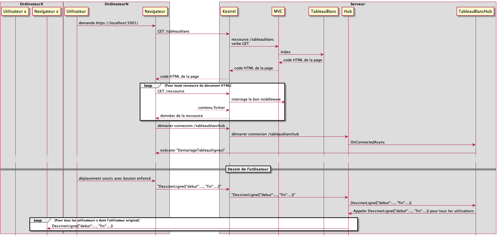
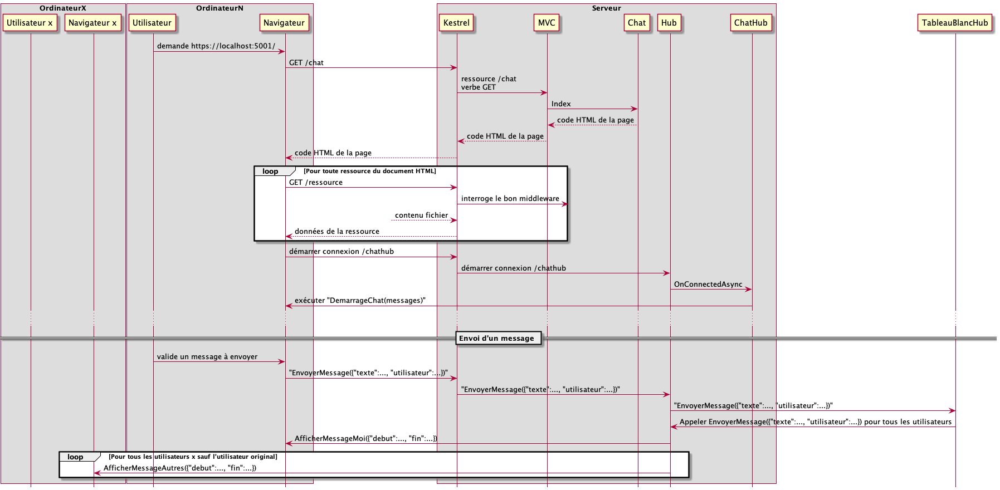
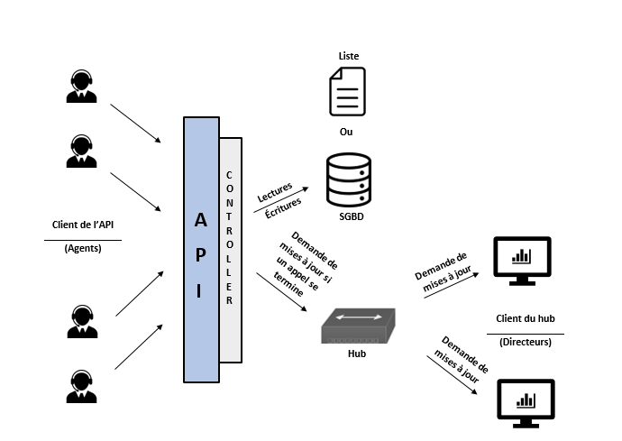

# Module 08 - Temps interactif

## Exercice 1 - Reprise du tableau blanc

Reprenez la solution Visual Studio "DSED_M08_DemoCours" du cours et ajoutez la possibilité d'avoir plusieurs tableaux blanc :

- Au démarrage du code client, listez les tableaux et laissez le client choisir quel tableau il va rejoindre
- S'il le souhaite, il peut ajouter un tableau grace à un textbox qui contient le nom du futur tableau et un bouton "Créer tableau" qui demande au serveur de le créer. Une fois créé, on rejoint le tableau blanc. Si le tableau existe déjà (déjà listé ou créé entre temps), on ne fait que le rejoindre
- Validez que le tout fonctionne

Pour gérer les différents tableaux, vous allez utiliser [la notion de groupe de SignalR](https://docs.microsoft.com/en-us/aspnet/signalr/overview/guide-to-the-api/working-with-groups) (Groups.Add(...) / Groups.Remove(...))

<details>
    <summary>Diagramme de séquence d'un utilisateur qui se connecte et qui dessine</summary>



</details>

## Exercice 2 - Chat

### Exercice 2.1 - Version mono canal

Le but est de créer une application client/serveur de chat multi-utilisateur, mono canal (salon).

- Dans une nouvelle solution Visual Studio de type ASP.Net Core MVC, créez un contrôleur vide nommé "ChatController"
- Ajoutez l’action "Index" qui renvoie simplement la vue (similaire à TableauBlancController")
- Ajoutez la vue correspondante à l’action "Index"
- Ajoutez un lien sur cette action dans le gabarit principal
- Ajoutez la classe "Message". Un message à deux propriétés : "Texte" et "NomUtilisateur" de type string
- Ajoutez la classe "ChatHub" dans le répertoire Hubs
- Écrivez la méthode "EnvoyerMessage" qui prend un message en paramètres. Le message est envoyé à tous les participants sauf l’emetteur (Others) en appelant la méthode "AfficherMessageAutres" du client. Le message est aussi envoyé à l’émetteur en utilisant la méthode "AfficherMessageMoi" du client.
- Ajoutez un point de terminaison (endpoint) dans le middleware SignalR qui pointe sur l’URI "/chathub"
- Remplacez la vue Index par le code suivant :

<details>
    <summary>Code Razor à utiliser pour la vue du chat</summary>

Merci à Simon Quillaud de la cohorte H23 pour sa proposition de correction du template web !
    
```csharp
@{
    ViewData["Title"] = "Index";
}

<h2>Chat</h2>

<div class="row" id="login-row">
    <div class="col-md-2">
        <div class="form-group">
            <label for="nomUtilisateur" class="control-label">Nom utilisateur</label>
            <input name="nomUtilisateur" id="nomUtilisateur" class="form-control" type="text" />
        </div>
        <button class="btn btn-warning btn-sm" id="btn-startChat">
            Démarrer le chat
        </button>
    </div>
</div>

<div class="row" id="chat-row" style="display:none">
    <div class="col-md-5">
        <div class="panel panel-primary">
            <div class="panel-heading" id="accordion">
                <span class="glyphicon glyphicon-comment"></span> Discussion en direct
            </div>
            <div class="panel-collapse" id="collapseOne">
                <div class="panel-body">
                    <ul class="chat" id="listeMessages"></ul>
                </div>
                <div class="panel-footer">
                    <div class="input-group">
                        <input id="message-input" type="text" class="form-control input-sm" placeholder="Type your message here..." />
                        <span class="input-group-btn">
                            <button class="btn btn-warning btn-sm" id="btn-send">
                                Send
                            </button>
                        </span>
                    </div>
                </div>
            </div>
        </div>
    </div>
</div>

@section scripts {
    <script src="~/lib/microsoft/signalr/dist/browser/signalr.js"></script>

    <script>
        $(function () {
            let connexion = null;
            let nomUtilisateur = null;
            document.getElementById("btn-startChat")
                .onclick = function () {
                    nomUtilisateur = document.getElementById("nomUtilisateur").value;

                    if (nomUtilisateur) {
                        document.getElementById("login-row").style.display = 'none';
                        document.getElementById("chat-row").style.display = 'block';

                        connexion = new signalR.HubConnectionBuilder().withUrl("/chatHub").build();

                        connexion.on("AfficherMessageAutres", function (message) {
                            afficherMessageAutre(message);
                        });

                        connexion.on("AfficherMessageMoi", function (message) {
                            afficherMessageMoi(message);
                        });

                        connexion.on("DemarrageChat", function (messages) {
                            messages.forEach(function (message) {
                                if (nomUtilisateur == message.nomUtilisateur) {
                                    afficherMessageMoi(message);
                                } else {
                                    afficherMessageAutre(message);
                                }
                            });
                        });

                        connexion.start().catch(function (err) {
                            return console.error(err.toString());
                        });

                        let afficherMessageAutre = function (message) {
                            afficherGabaritMessage(message, gabaritMessageUtilisateurAutre);
                        };

                        let afficherMessageMoi = function (message) {
                            afficherGabaritMessage(message, gabaritMessageUtilisateurCourant);
                        };

                        let afficherGabaritMessage = function (message, gabarit) {
                            gabarit = gabarit.replace("{{message}}", message.texte);
                            gabarit = gabarit.replace("{{userDisplayName}}", message.nomUtilisateur);

                            $("#listeMessages").append($(gabarit));
                        }
                    }
            };

            document.getElementById("btn-send")
                .onclick = function () {
                    let texteMessage = document.getElementById("message-input").value;
                    let message = {
                        texte: texteMessage,
                        nomUtilisateur: nomUtilisateur
                    };
                    connexion.invoke("EnvoyerMessage", message);

                    document.getElementById("message-input").value = "";
                };

        });

        let gabaritMessageUtilisateurCourant = `                            
                <li class="m-2 text-end">
                    <button type="button" class="btn btn-primary position-relative" disabled>
                                                        {{message}}
                        <span class="position-absolute top-0 start-100 translate-middle badge rounded-pill bg-primary-subtle text-black">
                                                          {{userDisplayName}}
                        <span class="visually-hidden">unread messages</span>
                        </span>
                    </button>
                </li>
            `;


        let gabaritMessageUtilisateurAutre = `
                <li class="m-2 text-start">
                    <button type="button" class="btn btn-success position-relative" disabled>
                                                    {{message}}
                        <span class="position-absolute top-0 start-0 translate-middle badge rounded-pill bg-success-subtle text-black">
                                                          {{userDisplayName}}
                        <span class="visually-hidden">unread messages</span>
                        </span>
                    </button>
                </li>
        `;
    </script>
}
```

</details>

<details>
    <summary>Diagramme de séquence d'un utilisateur qui se connecte et qui envoit un message</summary>



</details>

### Exercice 2.2 - Ajout de canaux

- Ajoutez la notion de canaux (salon) :
  - L'utilisateur démarre dans le canal "principal"
  - Il peut voir la liste de canaux et les rejoindre à tout moment

## Exercice 3 - Statistiques du service à la clientèle

- Créez une solution ASP.Net core MVC
- Créez une API REST qui permet de garder la trace des dates de début et de fin d'un appel pour un agent identifié par un entier
- Créez un hub qui envoie en temps réel le nombre d'appels de la journée courante, le temps moyen passé par appel, ainsi que le nombre d'agents présents
- Ajoutez l'appel au hub qui va forcer la mise à jour des données. Pour cela, à partir du contrôleur de l'API, [appelez les clients à l'aide de ce lien](https://docs.microsoft.com/en-us/aspnet/core/signalr/hubcontext?view=aspnetcore-5.0)
- Créez une page web qui affiche ces informations en utilisant le hub précédent

Schéma résumant le fonctionnement (Crédit Mélissa Lachapelle promotion Automne 2021) :


